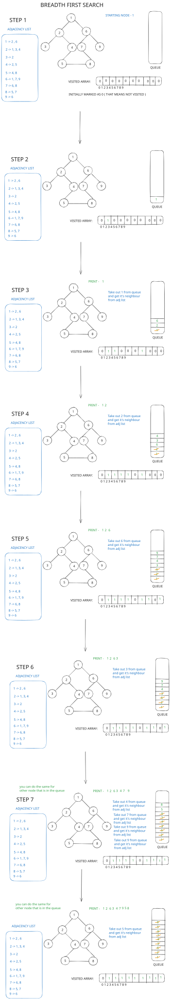

BFS Traversal:

[Excalidraw diagram](https://excalidraw.com/#json=pteC2Y6aRBHsfMppaFcwU,L2Oe3sa2YtsB3rhyj8dCfQ)



[1. Applications, Advantages and Disadvantages of Breadth First Search (BFS)](https://byjus.com/gate/breadth-first-search-algorithm-notes/)

[2. Applications, Advantages and Disadvantages of Breadth First Search (BFS)](https://www.geeksforgeeks.org/dsa/applications-of-breadth-first-traversal/)


# BFS Time Complexity — O(V + E) Explained

> Based on *Introduction to Algorithms* (CLRS), 4th Edition — Breadth-First Search runtime analysis.

## The Big Idea

BFS visits every vertex once, and looks at every edge a fixed number of times. So:

```
Total work = (work for vertices) + (work for edges) = O(V + E)
```

## Diagram: A Small Graph

```
        A
       / \
      B   C
     / \   \
    D   E   F
```

Here: **V = 6** vertices (A, B, C, D, E, F), **E = 5** edges.

## Step 1: Initialization Cost = O(V)

Before BFS starts, it sets up a "status box" for every single vertex (visited? distance? parent?).

```
[A] [B] [C] [D] [E] [F]
 |   |   |   |   |   |
init init init init init init   → touches each vertex once → O(V)
```

## Step 2: Scanning Cost = O(V + E)

Every vertex gets dequeued from the BFS queue **exactly once**. When it's dequeued, BFS scans its adjacency list (its list of neighbors, connected by `/` and `\` edges).

```
Dequeue A → scan A's list:  A / B   A \ C        (2 edges touched)
Dequeue B → scan B's list:  B / D   B \ E        (2 edges touched)
Dequeue C → scan C's list:  C \ F                (1 edge touched)
Dequeue D → scan D's list:  (empty)
Dequeue E → scan E's list:  (empty)
Dequeue F → scan F's list:  (empty)
```

Notice:
- Each vertex → dequeued once → **V** operations
- Each edge (`/` or `\`) → appears in exactly one scan → **E** operations total across *all* scans, not per vertex

So scanning costs:

```
O(V)  [for dequeuing]  +  O(E)  [for edge look-ups]  =  O(V + E)
```

## Why NOT More Than That?

A common confusion: "doesn't BFS check every edge for every vertex?" **No.** Each edge only lives in one adjacency list slot (or two, for undirected graphs — still a constant), so it only gets looked at when *that specific vertex* is dequeued — never repeatedly re-scanned.

```
   WRONG mental model:          RIGHT mental model:
   Vertex × Edge → O(V·E)       Vertex + Edge → O(V+E)
         ✗                             ✓
```

## Final Sum

```
   O(V)          +          O(V + E)          =        O(V + E)
initialization         scanning all lists           TOTAL RUNTIME
```

## "Linear in the Size of the Graph" — What Does That Mean?

The "size" of the adjacency-list representation itself is `V + E` (you need space to store V lists, holding E entries total). BFS's time is proportional to that same `V + E`:

```
   size of input   =  V + E
   time BFS takes  =  V + E
                       ─────────
                       Same shape! → "linear" in input size
```

That's the best possible result — you literally cannot process a graph without touching each vertex and each edge at least once, so BFS wastes nothing.

## Original Textbook Passage (for reference)

> "...the vertex is dequeued, it scans each adjacency list at most once. Since the sum of the lengths of all |V| adjacency lists is Θ(E), the total time spent in scanning adjacency lists is O(V + E). The overhead for initialization is O(V), and thus the total running time of the BFS procedure is O(V + E). Thus, breadth-first search runs in time linear in the size of the adjacency-list representation of G."

— *Introduction to Algorithms*, 4th Edition (Cormen, Leiserson, Rivest, Stein)