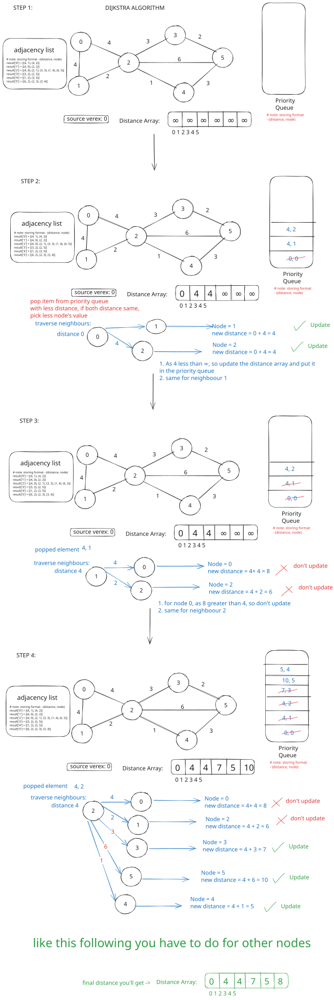
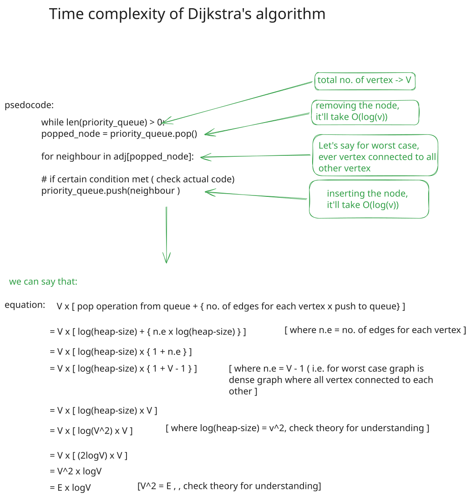

# Dijkstra's Algorithm

### Notes:

- INTRODUCTION TO ALGORITHMS
- [WATCH 4 VIDEOS STEP BY STEPS](https://www.youtube.com/watch?v=V6H1qAeB-l4&list=PLgUwDviBIf0oF6QL8m22w1hIDC1vJ_BHz&index=158)

## Implementation:

### Using Priority Queue:

[Excalidraw diagram](https://excalidraw.com/#json=7ZQpRMs9n8Pktq7odrKx5,UdDPJKQAGk0X6hjf_y37jw)

### Time complexity

- [Time complexity Excalidraw diagram ](https://excalidraw.com/#json=OH8iLN5hNve5YuTm6s0rg,9sQQ5PX3enOMMm8sJTJEIA)

### Using Set:

#### Note:

- Using set, it's time complexity not better than priority queue because using set, though we're saving future iteration but we're removing the element from the set that takes O(log(n)) .
