# Disjoint SET Data Structure

disjoint-set data structure, also called a union–find data structure or merge–find set, is a data structure that stores a collection of disjoint (non-overlapping) sets.
Two sets are called disjoint sets if they don't have any element in common. The disjoint set data structure is used to store such sets. It supports following operations:

- Merging two disjoint sets to a single set using Union operation.
- Finding representative of a disjoint set using Find operation.
- Check if two elements belong to same set or not. We mainly find representative of both and check if same.

#### Learning docs

- [video](https://youtu.be/aBxjDBC4M1U)
- [docs 1](https://takeuforward.org/data-structure/disjoint-set-union-by-rank-union-by-size-path-compression-g-46)
- Introduction to Algorithms book
- [doc 2](https://en.wikipedia.org/wiki/Disjoint-set_data_structure)
- [Application](https://en.wikipedia.org/wiki/Disjoint-set_data_structure#Applications)

#### Advantage:

```
Union-Find is used to determine the connected components in a graph. We can determine whether 2 nodes are in the same connected component or not in the graph. We can also determine that by adding an edge between 2 nodes whether it leads to cycle in the graph or not.

It is used to determine the cycles in the graph. In the Kruskal’s Algorithm, Union Find Data Structure is used as a subroutine to find the cycles in the graph, which helps in finding the minimum spanning tree.(Spanning tree is a subgraph in a graph which connects all the vertices, with minimum sum of weights of all edges in it is called minimum spanning tree).
https://www.quora.com/What-are-the-advantages-of-Union-Find-Disjoint-data-structure
```

#### Time complexity of disjoint set data structure


